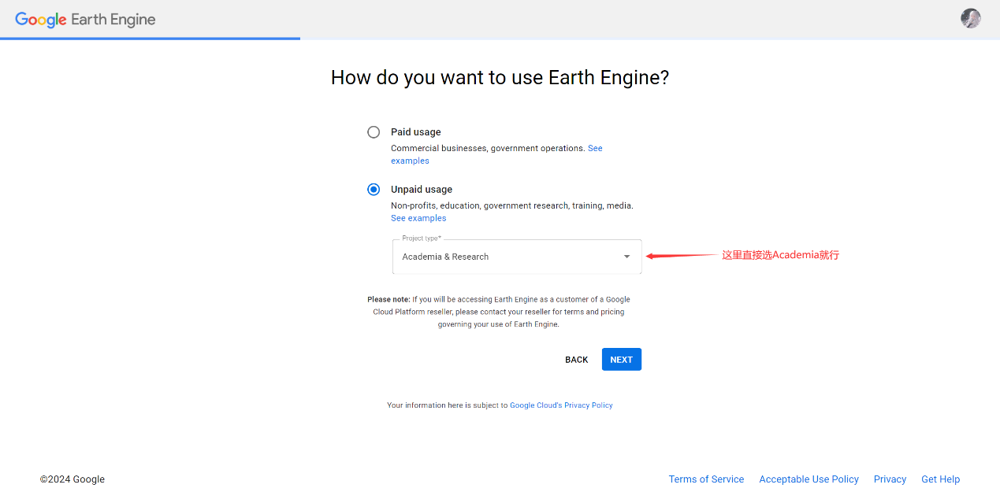
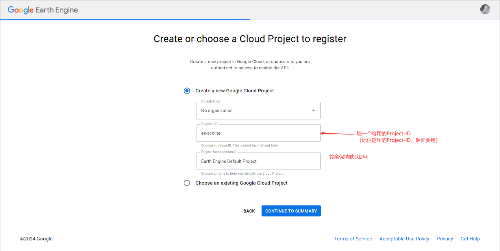
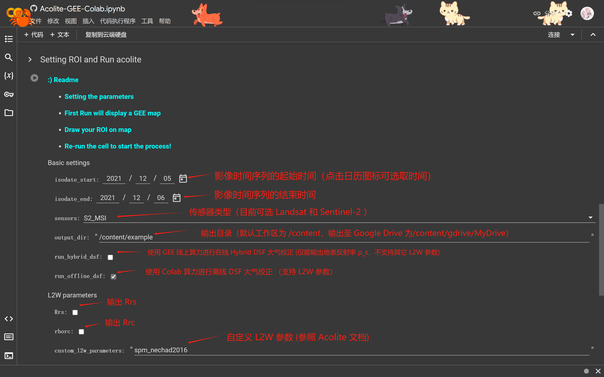
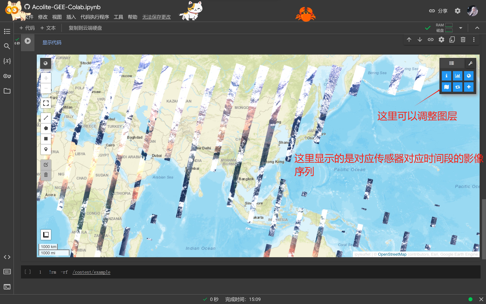
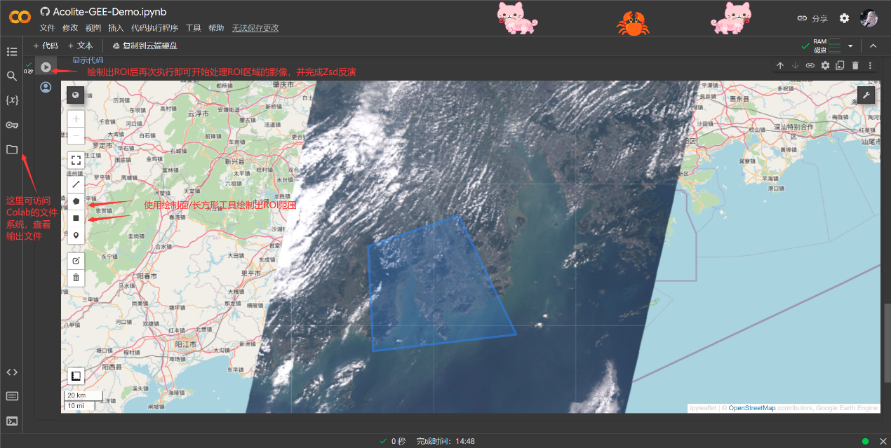

## 运行说明
### 0. 注册GEE Cloud Project
进入 [earthengine](https://code.earthengine.google.com/register) 登录Google账号进行 Cloud Project 注册。在以下两个页面填好信息后，后续一路确认即可。

### 1. 将代码并加载至Colab环境
打开这个[链接](https://colab.research.google.com/github/Isotr0py/Acolite-GEE-Colab/blob/main/Acolite_Notebook/Acolite-GEE-Colab.ipynb)即可将我们要运行的 [Acolite-GEE-Colab.ipynb](https://colab.research.google.com/github/Isotr0py/Acolite-GEE-Colab/blob/main/Acolite_Notebook/Acolite-GEE-Colab.ipynb) 加载至 colab 环境中。

### 2. 初始化代码运行环境
点击连接，按照下图说明设置好前三个单元格后，依次执行前三个单元格。（中间也是一路确认）

### 3. 运行 Acolite
按照下图说明设置好参数，运行最后一个单元格，将会输出一个可交互式的 GEE Map:

在地图上绘制出要处理的ROI，再次运行单元格即可开始影像处理：

